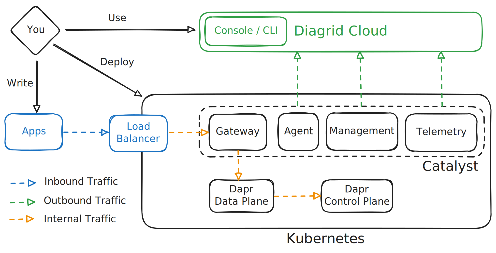

# Diagrid Helm Charts Repository

This repository contains official Helm charts published by Diagrid for deploying Diagrid products on Kubernetes.

> ⚠️ This repository is under active development. Documentation may be updated frequently.

## Available Charts

### Catalyst ⚡️

https://catalyst.diagrid.io

Catalyst is an enterprise platform for workflow orchestration, service discovery and pub/sub, powered by Dapr. Build apps and AI agents that are compliant, secure and failure-proof. Find out more at [diagrid.io/catalyst](https://www.diagrid.io/catalyst).

**Catalyst Enterprise Self-Hosted** enables you to self-host a Catalyst region within your own environment while using it as a service via Diagrid Cloud. This architecture separates the control plane (hosted by Diagrid Cloud) from the data plane (hosted in your Kubernetes cluster). The control plane manages configuration, while the data plane handles application connectivity and data.

You interact with your Catalyst Enterprise Self-Hosted installation via the [Diagrid Cloud web console](https://catalyst.diagrid.io) and CLI. The console fetches app data directly from your installation, so your machine must be able to reach your Catalyst Enterprise Self-Hosted ingress.



#### Components

- **Agent**: Manages Dapr project configuration.
- **Management**: Accesses service providers (e.g., secrets stores).
- **Gateway**: Routes to Dapr runtime instances.
- **Telemetry**: Exports telemetry from Dapr.
- **Piko**: Tunnels to applications on private networks.

#### Dapr API Compatibility

Catalyst supports the following Dapr APIs:

- [Workflows](https://docs.dapr.io/reference/api/workflow_api/)
- [Conversation](https://docs.dapr.io/reference/api/conversation_api/)
- [Service Invocation](https://docs.dapr.io/reference/api/service_invocation_api/)
- [State Management](https://docs.dapr.io/reference/api/state_api/)
- [Pub/Sub](https://docs.dapr.io/reference/api/pubsub_api/)
- [Bindings](https://docs.dapr.io/reference/api/bindings_api/)
- [Actors](https://docs.dapr.io/reference/api/actors_api/)
- [Secrets](https://docs.dapr.io/reference/api/secrets_api/)
- [Jobs](https://docs.dapr.io/reference/api/jobs_api/)
- [Distributed Lock](https://docs.dapr.io/reference/api/distributed_lock_api/)

#### Chart Reference & Guides

- [Catalyst chart reference](./charts/catalyst/README.md) — all configurable Helm values
- [Getting Started](./guides/getting-started/README.md) — signup, join token, first install
- [Deploying to KinD](./guides/kind/README.md)
- [Deploying to Azure Kubernetes Service (AKS)](./guides/azure/README.md)
- [Deploying to AWS Elastic Kubernetes Service (EKS)](./guides/aws/README.md)
- [Configuring Dapr PKI with cert-manager](./guides/dapr-pki/README.md)
- [Enabling tracing for Catalyst apps](./guides/tracing/README.md)
- [Air-gapped / private registry installs](./guides/air-gapped/README.md)

## Docs

For more information about Diagrid Catalyst, including detailed usage instructions and examples, please visit:

- [Catalyst Documentation](https://docs.diagrid.io/catalyst)
- [Catalyst Support](https://docs.diagrid.io/catalyst/support)
- [Diagrid Website](https://www.diagrid.io/)
- [Diagrid Support](https://diagrid.io/support)

## Contributing

We welcome contributions to our Helm charts. Please feel free to submit issues or pull requests.

### Development

If you're developing or testing a Helm chart locally, you'll need to manage dependencies:

#### Prerequisites

- [Helm](https://helm.sh/) v3.12.0+
- [helm-unittest](https://github.com/helm-unittest/helm-unittest) plugin for testing

#### Chart Dependencies

Each chart's `Chart.lock` file tracks exact dependency versions. This ensures consistent builds across all environments. When adding or updating dependencies:

1. Update the chart's `Chart.yaml` with the new dependency
2. Run `helm dependency update` to generate a new `Chart.lock`
3. Commit both `Chart.yaml` and `Chart.lock` to version control

To install dependencies locally, run:

```bash
# Install Helm dependencies
make helm-prereqs
```

#### Testing

```bash
# Run unit tests
make helm-test

# Run linting
make helm-lint

# Template the chart to verify output
make helm-template

# Run all validation
make helm-validate

# Run integration tests (requires Docker)
make helm-test-integration
```

## License

Copyright © Diagrid, Inc.
