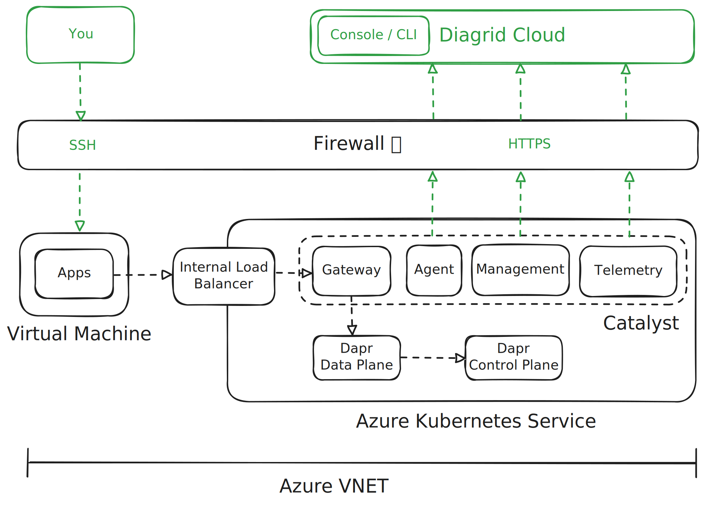

# Deploying Catalyst to Azure


This guide demonstrates how to deploy Catalyst Private in a private Azure Virtual Network. This setup is for demonstration purposes only and this should not be used in production.



> [!WARNING]
> This guide has not been adapted to run on Windows.

## Prerequisites

- [Diagrid CLI](https://docs.diagrid.io/catalyst/references/cli-reference/intro)
- [Azure CLI](https://learn.microsoft.com/cli/azure/install-azure-cli)
- [Helm](https://helm.sh/)
- [AWS CLI](https://docs.aws.amazon.com/cli/latest/userguide/getting-started-install.html) (for OCI registry login)
- [jq](https://stedolan.github.io/jq/download/)
- A valid Azure subscription
- SSH keys for VM access (or generate with ssh-keygen)

## Step 1: Create a Catalyst Region 🏢

Use the [Diagrid CLI](https://docs.diagrid.io/catalyst/references/cli-reference/intro) to create a new Region:

```bash
# The --api flag is only required when running against a none production environment.
diagrid login

# Set the wildcard domain that is going to be used to expose dapr runtime instances (e.g https://http-prj123.$WILDCARD_DOMAIN)
# We will annotate the gateway service to be exposed using this ip address: "10.42.1.180".
export WILDCARD_DOMAIN="10.42.1.180.nip.io"

# Create a new region and capture the join token
export JOIN_TOKEN=$(diagrid region create azure-region --ingress $WILDCARD_DOMAIN | jq -r .joinToken)

# Create an api key to use the Diagrid CLI in Azure
export API_KEY=$(diagrid apikey create --name azure-key --role cra.diagrid:editor --duration 8640 | jq -r .token)
```

## Step 2: Login to Azure 🪪

Login to the Azure CLI

```bash
az login
```

## Step 3: Deploy Azure Resources 📦

First, review `install.sh` to ensure you are happy with what it does when executed.

When ready, execute the script to create your Azure resources.

```bash
chmod +x ./install.sh
./install.sh
```

## Step 4: Connect to the Azure VM 🖥️

Open a terminal and setup a SSH connection to the Azure VM

```bash
# Connect to the Azure VM via SSH
chmod +x ./connect.sh
./connect.sh
```

From this point on, commands will be executed on the Azure VM

```bash
# Setup the VM
chmod +x "$HOME/setup.sh"
"$HOME/setup.sh"
rm "$HOME/setup.sh"

# Source the environment
source .env

# Login to Diagrid CLI
diagrid login --api-key="$API_KEY"
```

## Step 5: Install PostgreSQL (Optional) 💿

If you want to use the [Dapr Workflow API](https://docs.dapr.io/developing-applications/building-blocks/workflow/workflow-overview/), install [PostgreSQL](https://www.postgresql.org/):

```bash
# Add Bitnami chart repository
helm repo add bitnami https://charts.bitnami.com/bitnami
helm repo update

# Install PostgreSQL
helm install postgres bitnami/postgresql \
  --set auth.postgresPassword=postgres \
  --set auth.database=catalyst \
  --create-namespace \
  --namespace postgres
```

## Step 6: Configure and Install Catalyst ⚡️

Create a Helm values file for the Catalyst installation:

```bash
# If you installed PostresSQL
cat > catalyst-values.yaml << EOF
agent:
  config:
    project:
      default_managed_state_store_type: postgresql-shared-external
      external_postgresql:
        enabled: true
        auth_type: connectionString
        namespace: postgres
        connection_string_host: postgres-postgresql.postgres.svc.cluster.local
        connection_string_port: 5432
        connection_string_username: postgres
        connection_string_password: postgres
        connection_string_database: catalyst
gateway:
  envoy:
    service:
      type: LoadBalancer
    podAnnotations:
        service.beta.kubernetes.io/azure-load-balancer-internal: "true"
        service.beta.kubernetes.io/azure-load-balancer-ipv4: 10.42.1.180
EOF

# If you did not install PostgreSQL
cat > catalyst-values.yaml << EOF
agent:
  config:
    project:
      default_managed_state_store_type: postgresql-shared-disabled
gateway:
  envoy:
    service:
      type: LoadBalancer
    podAnnotations:
        service.beta.kubernetes.io/azure-load-balancer-internal: "true"
        service.beta.kubernetes.io/azure-load-balancer-ipv4: 10.42.1.180
EOF
```

Install the Catalyst Helm chart:

```bash
# Authenticate with the public AWS registry
aws ecr-public get-login-password \
     --region us-east-1 | helm registry login \
     --username AWS \
     --password-stdin public.ecr.aws

# Install Catalyst using the Helm chart
helm install catalyst oci://public.ecr.aws/diagrid/catalyst \
     -n cra-agent \
     --create-namespace \
     -f catalyst-values.yaml \
     --set join_token="${JOIN_TOKEN}" \
     --version 0.5.0
```

## Step 7: Verify the Installation ✅

Wait for all the Kubernetes pods to be ready:

> [!NOTE]
> This may take several minutes ⏳

```bash
kubectl -n cra-agent wait --for=condition=ready pod --all --timeout=5m
```

## Step 8: Create a Project and Deploy App Identities 🚀

Create a new Project in your Region
```bash
# Create the project
diagrid project create azure-project --region azure-region

# Use the project
diagrid project use azure-project
```

Create [App Identities](https://docs.diagrid.io/catalyst/concepts/appids) in your Project
```bash
diagrid appid create app1
diagrid appid create app2

# Wait until the appids are ready
diagrid appid list

# See your Dapr runtime instances running in Kubernetes
kubectl get po -A | grep prj
```

Open a new SSH connection to the Azure VM to start a listener

```bash
# Connect a new SSH session to the Azure VM
./connect.sh

# Start a listener for app1, wait until a log line like:
# ✅ Connected App ID "app1" to http://localhost:61016 ⚡️
diagrid listen -a app1
```

Send messages between your App Identities

> [!WARNING]
> The Catalyst Gateway currently does not support TLS and expects it to be terminated externally. This will be fixed soon.

```bash
# From the original SSH session, call app1 from app2
GATEWAY_TLS_INSECURE=true GATEWAY_PORT=8080 diagrid call invoke get app1.hello -a app2

# You will now see the requests being received on your app 1 listener
# ...
# {
#   "method": "GET",
#   "url": "/hello"
# }
```

This proves that you are able to use [Dapr's service invocation API](https://docs.dapr.io/developing-applications/building-blocks/service-invocation/service-invocation-overview/) by calling your App Identity over a private IP.

In this scenario, we have used the Diagrid CLI to act as both the sending and receiving applications.

To view more details, from your host machine (not in Azure), open the Catalyst web console by running:

```bash
# Open the Catalyst console in your web browser
diagrid web
```

## Step 8: Write your applications 🎩

Now that you've demonstrated how to deploy a Project to your Catalyst Region along with 2 App Identities. You can head over to our [local development docs](https://docs.diagrid.io/catalyst/how-to-guides/develop-locally) to see how to start writing applications that can leverage App Identities to easily build distributed systems.


## Secrets

Currently we only support storing secrets in Kubernetes or AWS Secrets Manager. Support for Azure Key Vault is on the roadmap.
